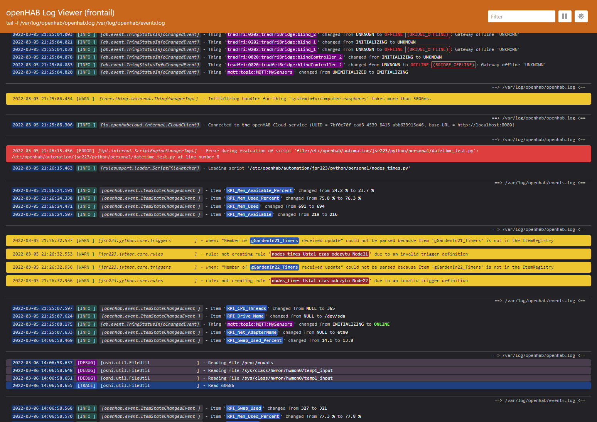
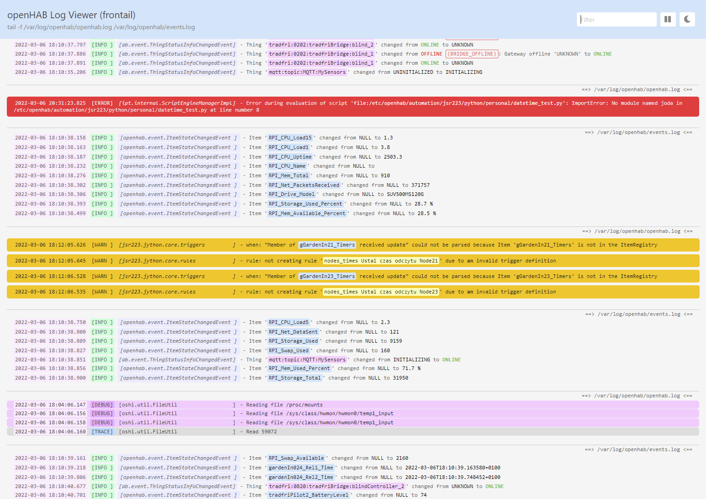

# openHAB Frontail AGM Theme

These are my versions of the themes for the **openHAB Log Viewer** (*Frontail*).
There are two themes available:
- Light  
and
- Dark.  
My themes are based on basic themes available in openHAB 3x, but there are some changes in colors and displaying which makes logs very readable.
I also corrected wrong *INFO* logs displaying as error lines.
I hope you will like them.

### Dark Theme:

### Light Theme:

## How to change Theme in openhabian 3x.
1. The `openhab_AEM.css` file should be uploaded to the directory: `/opt/frontail/web/assets/styles` (overwrite the existing file).
2. The `openhab_AEM.json` file should be uploaded to the directory: `/opt/frontail/preset` (overwrite the existing file).
3. You need to restart the Frontail service by issuing the commands:
- `sudo systemctl daemon-reload`
- `sudo service frontail restart`
